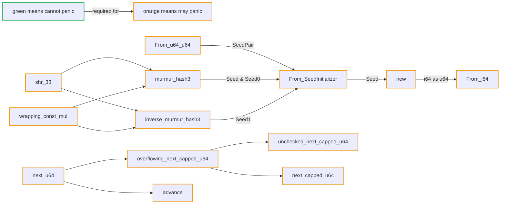

# libgdx-xs128

A minimalist replication of `RandomXS128` from the Java library [libgdx](https://github.com/libgdx/libgdx). Implementation inspired by [sts_map_oracle](https://github.com/Ru5ty0ne/sts_map_oracle/).
Unit tests generated in [Java](https://github.com/ariasanovsky/rng-java-app).

## Features

- Generates pseudo-random numbers using a [128-bit Xorshift algorithm](https://en.wikipedia.org/wiki/Xorshift).
- (in progress): enforce `no_panic` on `new_rng` module
- (if requested): Implement the `RngCore` and `SeedableRng` traits from the `rand_core` crate for compatibility with other Rust crates that use the same trait.

## Model-checking with `kani`

We verify partial equivalence of the modules `old_rng` and `new_rng` with the `kani` model checker ([Github](https://github.com/model-checking/kani), [site](https://github.com/model-checking/kani), [crates.io](https://crates.io/crates/kani-verifier), [lib.rs](https://lib.rs/crates/kani-verifier)).
This helps us refactor `new_rng` to always compile without a single `panic`.

## Panic-free progress

## License

Dual-licensed to be compatible with the `Rust` project.

Licensed under the [Apache License, Version 2.0](https://www.apache.org/licenses/LICENSE-2.0) or the [MIT license](http://opensource.org/licenses/MIT), at your option.
This file may not be copied, modified, or distributed except according to those terms.
